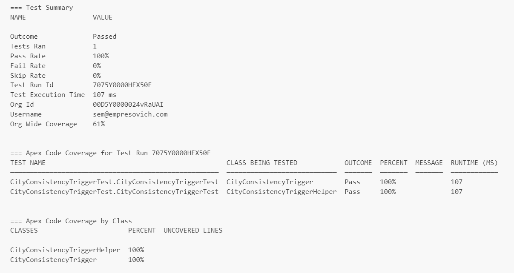

# Salesforce Technical Test (challenged by Cristhian Ortiz)

This repository includes the hole solution for the technical challenge. The task was:

> Create a trigger that when the city of an account changes, it also changes the city for all the contacts within that account.

## Analysis

The trigger should be configured to be executed for **after update** context only. I'll explained this in two parts: the *after* and the *update*.

Quoting from Salesforce [documentation](https://developer.salesforce.com/docs/atlas.en-us.apexcode.meta/apexcode/apex_triggers.htm) on Apex Triggers:

> There are two types of triggers:
> - *Before triggers* are used to update or validate record values before they’re saved to the database.
> - *After triggers* are used to access field values that are set by the system (such as a record's Id or LastModifiedDate field), and to affect changes in other records, such as logging into an audit table or firing asynchronous events with a queue. The records that fire the after trigger are read-only.

Based on this, the best option would be **after**, because we are going to update Contact records related to the Account record.

The other thing to decide is whether to use the *insert*, *update* or *upsert* event. The key thing here is: when an Account was just created, and the insert trigger executed, the are no Contact records yet! The Contact records will be created or related to the Account later. So the only event that we should be using is the **update**.

## Considerations

The standard Account object has two fields for City: BillingCity and ShippingCity. At the same time, the standard Contact object has two other fields for City: MailingCity and OtherCity. For the sake of the exercice, I asumed that the mapping needed is from Account.BillingCity to Contact.MailingCity fields.

## About the solution

I separated the hole solution in two classes (this is a good practice that Salesforce itself encourage):
1. **CityConsistencyTrigger** has the main configuration of the object and context events. As well, here is where the filtering logic is written.
2. **CityConsistencyTriggerHelper** is called inside the Trigger when the map of data is ready to be processed. It has the field mapping and the logic of the bussiness requirement.

## Apex testing

I wrote an Apex class to test the hole solution (both trigger and helper), so this could be ready to be deployed on production right away. The class is called **CityConsistencyTriggerTest**, and has a setup method where the test records are created.

Code coverage 100% ✅:

